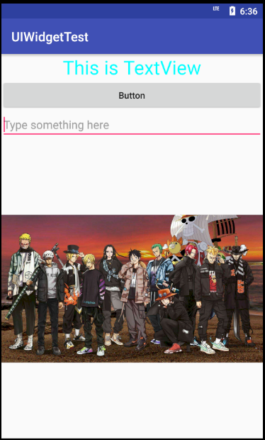
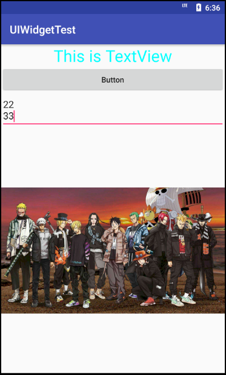
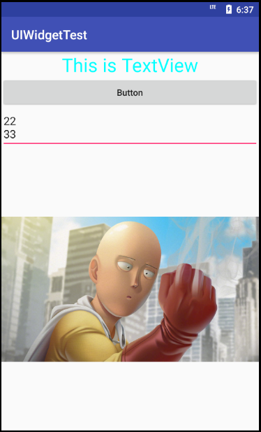
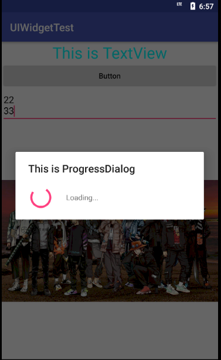

# 基本UI控件和布局，以及他们的事件回调函数应用。

实现界面如图

从上到下分别是TextView、Button、EditText、ImageView

match_parent表示让当前控件的大小和父布局的大小一致，也就是由父布局来决定当前控件的大小。

wrap_content表示当前控件大小刚好包含住里面的内容，也就是由控件内容决定当前控件的大小。

当输入内容时，提示性文本会消失，EditText中输入

11

22

33

只能看到22和33，因为这里通过android:maxLines指定了ExitText的最大行数为两行，当输入内容超过两行时文本会向上滚动，ExitText不会继续拉伸。

更改按钮功能，点击按钮切换图片

更改按钮功能，点击显示加载悬浮窗

